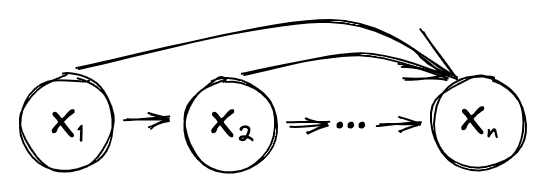
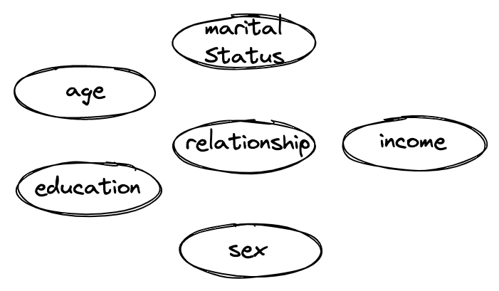
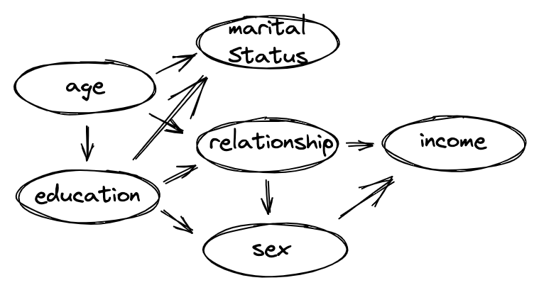
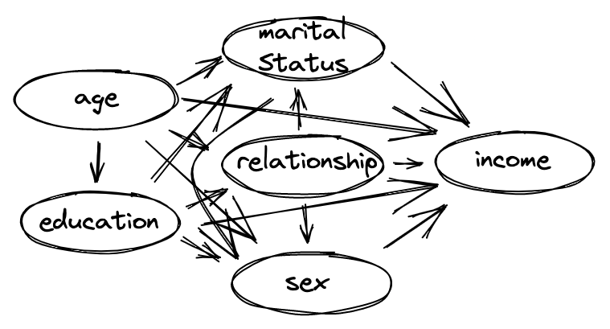

# DPART | Differentially Private Auto-Regressive Tabular

## Abstract

<p align="center">
  
</p>


We propose a general, flexible, and scalable framework `dpart`, an open source Python library for differentially private synthetic data generation.

Central to the approach is autoregressive modelling breaking the joint data distribution to a sequence of lower-dimensional conditional distributions, captured by various methods such as machine learning models (logistic/linear regression, decision trees, etc.), simple histogram counts, or custom techniques.

The library has been created with a view to serve as a quick and accessible baseline as well as to accommodate a wide audience of users, from those making their first steps in synthetic data generation, to more experienced ones with domain expertise who can configure different aspects of the modelling and contribute new methods/mechanisms.
Specific instances of `dpart` include Independent, an optimized version of _PrivBayes_, and a newly proposed model, **dp-synthpop**.

## Installation


*dpart* is written in Python due to the language popularity among data
scientists as well as machine learning researchers and practitioners. It
can be installed using pip:

``` bash
> pip install dpart
```


##  Example

The example bellow show cases a typical use of the **dpart** framework.

```python
import pandas as pd
from pathlib import Path
from dpart.engines import PrivBayes

# Get training data
train_df = pd.read_pickle("experiments/data/adult/tiny_adult.pkl.gz")

# Initialise model
pb_model = PrivBayes(
              epsilon=0.1
          )

# Fit model to training data
pb_model.fit(train_df)

# Generate Data
synth_data = pb_model.sample(train_df.shape[0])

```


## Training & Generation

In this subsection, we look at the arguments responsible for:
1. building/specifying the dependency
2. the methods for estimating the conditional distributions
3. privacy budget distribution.

### Dependency arguments


#### `visit_order`
* __dtype__: `List[str]`
* __description__: a list representing the order in which the the joint distribution is broken down into a sequence of conditionals.

#### `prediction_matrix`
* __dtype__: `Dict[str, List[str]]`
* __description__: Dictionary specifying the collection of all (already visited) columns to be used as features/predictors for each unvisited column. When specified, the visit order is identified through khan sorting.

#### `n_parents`
* __dtype__: `int`
* __description__:  Alternatively, `prediction_matrix` could be selected to `"infer"`. In this case, an optimal network, maximizing the mutual information between the columns, is built. Furthermore, in order to reduce the number of computations, `n_parents`, a maximum number of columns to be considered as features, could be specified. Differential Privacy is guaranteed through the Exponential mechanism.

_NOTE: At most one of *visit_order* and *prediction_matrix* could be used, as the two arguments conflict with each other._


### Methods arguments:

####`methods`
* __dtype__: `Dict[str, Method]`
* __description__: Dictionary that determines the specific method each column should be modelled by. Columns must match the data type support of the
selected method.

A list with currently available methods is shown below and further explanations provided below:


| Method | Data Type Support |
|--------|-------------------|
|DP Linear Regression| Numerical|
|DP Decision Tree| Categorical|
|DP Random Forest| Categorical|
|DP Logistic Regression| Categorical|
|DP Conditional Distribution| Numerical & Categorical|
|DP Histogram Sample| Numerical & Categorical|


The currently available methods can be split into the following three
categories.

##### Numerical methods

These methods can be applied on target columns
with numerical data type (i.e., `float`, `integer`, `datetime` and `timedelta`):

*  **Regression** methods: Relies on fitting a DP regression model to predict the target column. In order to allow for non-deterministic behavior, the standard deviation of the residuals is captured in a DP way using the _Laplace mechanism_. During generation, new values are sampled by adding appropriate noise to the prediction from the trained regression.
Currently available regression methods are: *DP linear regression*.


##### Categorical methods

The methods below can be used on categorical
columns with either an `object`, `category`, or `bool` data type:
*  **classifier** methods: Fits a DP classification model that can output a conditional distribution. The available classification methods are: *DP logistic regression*, *DP decision tree*, and *DP random forest*.
:::

##### Dtype-invariant methods

*  **DP conditional distribution**: it captures and samples from a discretized joint distribution. Numerical data is binned using uniform binning to allow for a discrete representation of the distribution and DP is satisfied by adding a Laplace noise to the counts before
converting to a distribution.

* **DP histogram sampler**: this method captures the marginal distribution of the target column without taking into account any input features. It is a specific use case of *DP conditional distribution*.

### privacy budget arguments

#### `epsilon`
* __dtype__: `float`
* __description__:  a positive real number which defines the overall privacy budget to be used across the fitting step.

Alternatively, a dictionary describing how the privacy budget can be split between the dependency and the methods steps could be provided. Furthermore, the user can further break down the privacy budget between
the specific methods for each column.


#### `bounds`
* __dtype__: `Dict[str, List]`
* __description__: a dictionary specifying the range (minimum and maximum) for all numerical columns as well as the distinct categories for categorical
columns. This ensures that no further privacy leakage is happening. Alternatively, *PrivacyLeakWarning* is displayed (see below).


## Troubleshooting

Inspired by diffprivlib, we adopt specific privacy (and other) warnings messages:


* `PrivacyLeakWarning`: this warning is raised when privacy related input from a user is missing. A good example is `bounds` which must be provided to ensure that no privacy leakage is incurred. However, if the bounds
are not provided, the algorithm will run and infer the missing bound values but will raise a warning (if epsilon has been provided).

* `UserWarning`: Currently when a method is not explicitly specified for a given column, a UserWarning is raised to display which default method has been chosen.

## Available engines

In this section, we present three specific instances of **dpart**.


|Model          |         Notes        |    Ref    |
|---------------|----------------------|-----------|
| `Independent` | simple baseline model ||
| `PrivBayes` | optimized model |@zhang2017privbayes, @ping2017datasynthesizer|
| `dp-synthpop` | new model, DP version of synthpop | @nowok06synthpop |

### `independent`

<p align="center">
  
</p>

This specific use case models all columns independently by using *DP histogram sampler*. The model has also been used as a baseline by [@tao2021benchmarking; @stadler2022synthetic] and while it looks very
simple and naive, it has been shown that it could perform better than far more sophisticated models. The dependency graph is presented in the figure above. The code excerpt below demonstrates how one could initiate, fit
*Independent*, and generate 1,000 rows for given privacy budget,
dataset, and dataset bounds:

``` python
from dpart.engines import Independent

dpart_ind = Independent(epsilon, bounds=X_bounds).fit(X)
synth_df = dpart_ind.generate(1000)
```

## `PrivBayes`

<p align="center">
  
</p>

*PrivBayes* could also be seen as a sub case of *dpart*. We speed up the implementation offered by [@ping2017datasynthesizer] by 20x by
re-implementing the dependency-inference step. Further performance improvements can be achieved by proposing alternative, more efficient dependency-inference approaches. A possible dependency graph produced by
*PrivBayes* is shown in figure above, while a code example could be found below:

``` python
from dpart.engines import PrivBayes

dpart_pb = PrivBayes(epsilon, bounds=X_bounds).fit(X)
synth_df = dpart_pb.generate(1000)
```

**dp-synthpop.**

<p align="center">
  
</p>

Yet another instance of our framework, alas not DP, is synthpop. We built on top of it and propose a DP version, called *dp-synthpop*. In order to achieve this, we utilize the DP dependency step from our framework (if *visit_order* or *prediction_matrix* is not presented) and the DP predictive models from diffprivlib. A possible dependency graph is visualized in the figure above and a call to the model is presented below:

``` python
from dpart.engines import DPsynthpop

dpart_dpsp = DPsynthpop(epsilon, bounds=X_bounds).fit(X)
synth_df = dpart_dpsp.generate(1000)
```
